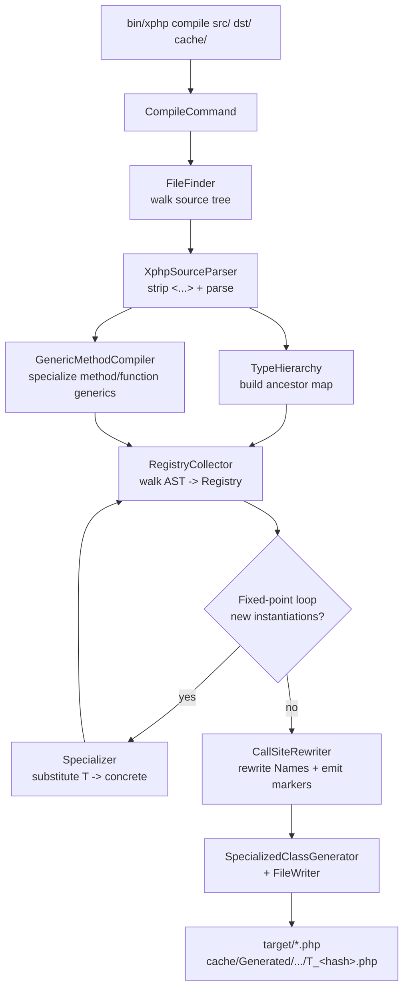
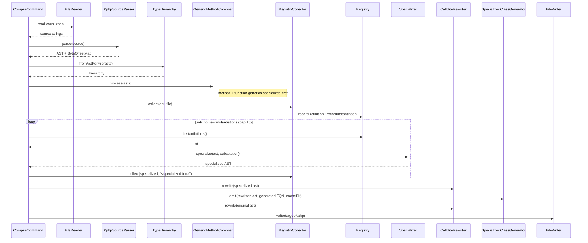
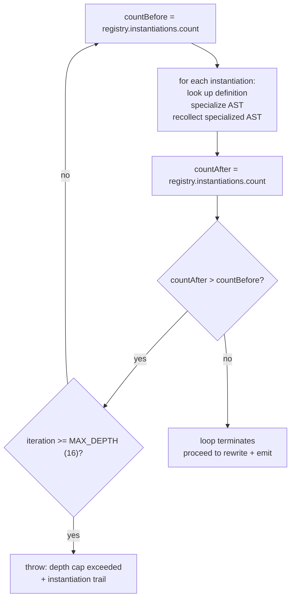
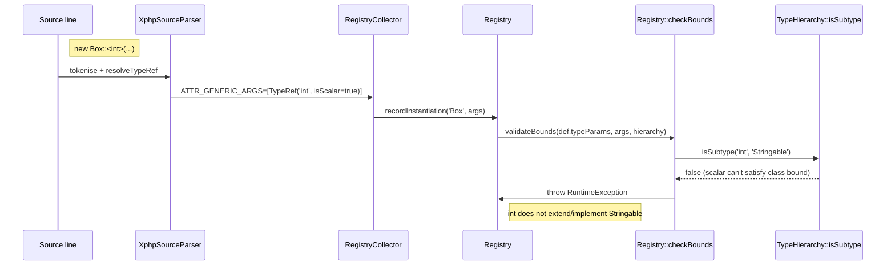
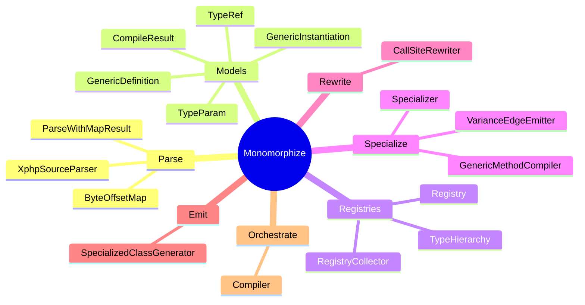

# How the xphp compiler works

Narrative walkthrough of the compile pipeline -- what `bin/xphp compile`
does between reading `.xphp` source and writing vanilla `.php` files
that any stock PHP 8.4 runtime can execute. Each stage is paired with
a Mermaid diagram so the same information is available both
visually and in prose.

For the feature inventory ("what does xphp support today?") see the
[syntax tour](../syntax/index.md). For the strategic comparison against
TypeScript / Kotlin / Rust see [comparison](comparison.md). For the
forward-looking inventory see [roadmap](../roadmap.md).

---

## Pipeline overview

`bin/xphp compile <source-dir> [target-dir] [cache-dir]` runs a single
function -- [`Compiler::compile()`](../../src/Transpiler/Monomorphize/Compiler.php)
-- that orchestrates six stages. Only `<source-dir>` is required; `[target-dir]`
defaults to `dist` and `[cache-dir]` defaults to `.xphp-cache`. The data flows top-down: source bytes
turn into AST, the AST populates a Registry and a TypeHierarchy, a
fixed-point loop expands every concrete instantiation into a specialized
class file, and finally the rewritten user code lands in the target
directory while specialized classes land in a cache directory at
`<cache-dir>/Generated/<template>/T_<hash>.php` (autoloaded under the
`XPHP\Generated\` namespace).

> The code's internal labels (`Phase 0`, `Phase 1a`, `Phase 1b.i`,
> `Phase 1b.ii`, `Phase 2`, `Phase 2.5`, `Phase 3`, `Phase 4`,
> `Phase 5`) are finer-grained than the six narrative stages below.
> The stages group related phases for explanation; the source
> docblock comments are the authority on exact ordering.

The same lifecycle as a sequence diagram, showing call order between
participants:

---

## Stage 1 -- Source parsing

PHP doesn't recognise `class Box<T>` or `function identity<T>(T $x)`
as legal syntax. nikic/php-parser would reject the source at the
first `<`. The compiler works around this with a token-level **strip
and reattach** trick implemented in
[`XphpSourceParser`](../../src/Transpiler/Monomorphize/XphpSourceParser.php):

1. **Tokenise** the source via PHP's own `token_get_all`.
2. **Scan** for generic clauses -- `Name<...>` patterns -- with
   depth tracking so arbitrarily nested `Box<List<Plastic>>` constructs
   are handled.
3. **Blank** every `<...>` clause by overwriting it with spaces of
   equal length, producing plain valid PHP while keeping every byte
   offset and line number identical to the original source.
4. **Parse** the stripped source with nikic.
5. **Reattach** the generic metadata to the resulting AST as node
   attributes (`ATTR_GENERIC_PARAMS` on ClassLike declarations,
   `ATTR_GENERIC_ARGS` + `ATTR_TEMPLATE_FQN` on instantiation Names,
   `ATTR_METHOD_GENERIC_PARAMS` / `ATTR_METHOD_GENERIC_ARGS` on
   method-scope generics).

Because the `<...>` clauses are blanked with equal-length spaces,
generic-clause stripping needs no position bookkeeping at all -- AST
offsets round-trip to the original source for free. The one
length-changing rewrite is the `T[]` array-suffix sugar: `T[]` (3
bytes) becomes `array` (5 bytes), which shifts every offset to its
right. That's what
[`ByteOffsetMap`](../../src/Transpiler/Monomorphize/ByteOffsetMap.php)
solves: it records each length-changing segment so any later byte
offset in the stripped source can be translated back into the
original -- which matters for editor diagnostics ("the offending
`<int>` is at line 12, column 5"). When no length-changing
replacement happened the map is the identity and returns the offset
unchanged. The pair of (AST, ByteOffsetMap) is returned together as
[`ParseWithMapResult`](../../src/Transpiler/Monomorphize/ParseWithMapResult.php).

The parser exposes strict and tolerant modes, each in a with-map and
without-map variant:

- `parse()` / `parseWithMap()` -- strict mode, throws on parse
  errors. `bin/xphp compile` uses the strict path because
  compilation must fail on broken source.
- `parseTolerant()` / `parseTolerantWithMap()` -- recover from
  trailing parse errors by feeding the stripped source through
  nikic's error-handler-collecting mode. Used when callers need
  partial results from incomplete source.

---

## Stage 2 -- Hierarchy and Registry construction

Two parallel structures get populated from the parsed ASTs.

**`TypeHierarchy`** ([source](../../src/Transpiler/Monomorphize/TypeHierarchy.php))
is a direct-ancestor map keyed by FQN: for every `class Foo extends Bar
implements Baz` declaration, it records `Foo => [Bar, Baz]`. Transitive
ancestors are walked on demand via `isSubtype()`. A small whitelist of
PHP built-in interfaces (`Stringable`, `Countable`, `Iterator`, `Traversable`,
`ArrayAccess`, `JsonSerializable`, `Throwable`, etc.) is treated as known
even without a source declaration -- a user class that explicitly
`implements \Stringable` resolves its bound without the hierarchy
needing to model PHP's internal class table.

**`Registry`** ([source](../../src/Transpiler/Monomorphize/Registry.php))
is the bookkeeping core of monomorphization. It holds two maps:

- `definitions: array<string, GenericDefinition>` keyed by template
  FQN -- one entry per `class Foo<T>` / `interface Foo<T>` / `trait
  Foo<T>` / `function foo<T>(...)` template.
- `instantiations: array<string, GenericInstantiation>` keyed by
  the generated FQN -- one entry per concrete `(template, args)`
  pair seen anywhere in the source set, including transitively
  through specialization.

Each map value is a small value object:

- [`GenericDefinition`](../../src/Transpiler/Monomorphize/GenericDefinition.php)
  carries `(templateFqn, templateShortName, typeParams, templateAst,
  sourceFile)`.
- [`GenericInstantiation`](../../src/Transpiler/Monomorphize/GenericInstantiation.php)
  carries `(templateFqn, concreteTypes, generatedFqn)`.

**`RegistryCollector`** ([source](../../src/Transpiler/Monomorphize/RegistryCollector.php))
walks an AST and calls `Registry::recordDefinition()` for every
template ClassLike and `Registry::recordInstantiation()` for every
Name node carrying concrete generic args.

`recordInstantiation()` is recursive: when called on
`Wrapper<Box<Plastic>>`, it first records `Box<Plastic>` (so the
inner generic shows up before the outer one) and then `Wrapper<...>`.
Bounds are validated inside `recordInstantiation()` -- see Stage 6
below.

---

## Stage 3 -- Method- and function-scope specialization

Method-scoped generics (`Cls::method::<T>(...)`) and free generic
functions (`function f<T>(...)`) are handled by a separate pass
before the class-level fixed-point loop runs. The reason is that
their specialization is **call-site driven**: each unique arg list
mints one mangled method or function appended to the same class /
namespace.

[`GenericMethodCompiler::process()`](../../src/Transpiler/Monomorphize/GenericMethodCompiler.php)
runs on the full `astPerFile` map and:

1. Collects every method-template (`ClassFqn::methodName`) and
   free-function template (`Namespace\functionName`).
2. Collects every `StaticCall` / `FuncCall` carrying
   `ATTR_METHOD_GENERIC_ARGS` -- those are the call sites the
   scanner detected during parse.
3. For each call site, mangles a name (`methodName_T_<hash>` or
   `functionName_T_<hash>`), clones the template body, substitutes
   the type-param, and appends the result to the owning class
   (for methods) or namespace (for functions). Calls
   `Registry::checkBounds()` first so bound violations on
   method-level type-params fire before the body is cloned.
4. Strips the original template `ClassMethod` / `Function_`.
5. Rewrites each call site's identifier to the mangled name.

**Call-site coverage**: static calls (`Cls::method::<int>(...)`),
instance calls (`$obj->method::<int>(...)`), and the nullsafe variant
(`$obj?->method::<int>(...)`) all rewrite. Receiver-type analysis
walks the AST tracking each variable's class from typed parameters,
typed properties, `$this`, and local `$x = new Foo()` assignments;
when the receiver class is unambiguous, the call binds to the right
specialization. When the analysis can't prove a single class (e.g.,
after a branching reassignment whose arms disagree), the turbofish call
is a compile error (`xphp.undetermined_receiver`) rather than a silently
de-specialized call that would fatal at runtime
— see the [branching narrowing caveat](../caveats.md#branching-narrowing-precision-loss).

Method-scoped generics work on non-generic AND generic enclosing
classes; the type-param scopes from each layer are kept distinct.

---

## Stage 4 -- Class-level fixed-point specialization

After method-scope specialization is done, the class-level loop runs
inside [`Compiler::compile()`](../../src/Transpiler/Monomorphize/Compiler.php)
to drive the [`Specializer`](../../src/Transpiler/Monomorphize/Specializer.php).

The loop is fixed-point because **specialization can introduce new
instantiations**. The textbook example: `class Wrapper<T> { public
Box<T> $b; }` is itself just a template, but when instantiated as
`Wrapper<Plastic>`, the substitution produces a body that references
`Box<Plastic>` -- a new instantiation that didn't exist in the
original source. The fixed-point loop catches that transitively
through any depth.

`Specializer::specialize()` takes the template AST and a substitution
map (`['T' => 'App\Models\Plastic']`), clones the AST, and replaces
every Name node referencing a type-param with a `FullyQualified`
node pointing at the concrete type. The result is a stand-alone
ClassLike AST that can be emitted as a normal `.php` file once
rewriting runs.

**The 16-iteration depth cap** exists to abort pathological recursive
types -- a `class Recursive<T> { public Box<Recursive<T>> $b; }` would
spin forever without it. On hitting the cap, the compiler throws with
the full instantiation trail so the user can see which template caused
the runaway.

---

## Stage 4.5 -- Variance-edge emission

Once the fixed-point loop has recorded *every* specialization (and not
before -- the comparison is pairwise across the full set), a single
pass over the specialized ASTs wires up the real subtype edges that
declaration-site variance promises.
[`VarianceEdgeEmitter::emitEdges()`](../../src/Transpiler/Monomorphize/VarianceEdgeEmitter.php)
walks each pair of specializations of the same variant template and,
where the type arguments are related the right way, adds the
`extends` / `implements` link between them: `Producer<Banana>`
actually `extends Producer<Fruit>` when `Banana extends Fruit` and
`T` is covariant (`out T`), dually for contravariant (`in T`). The edges
are appended to the cloned specialization's `implements` / `extends`
list and survive the next stage untouched -- the rewriter only
rewrites *template* `Class_` / `Interface_` nodes, not specialized
ones.

---

## Stage 5 -- Rewriting and emission

Two transformations happen during rewrite, both implemented in
[`CallSiteRewriter`](../../src/Transpiler/Monomorphize/CallSiteRewriter.php):

1. **Generic Name nodes become FullyQualified references.** Every
   Name node carrying `ATTR_GENERIC_ARGS` (with all args fully
   concrete) is replaced with a `FullyQualified` Name pointing at
   the Registry's generated FQN. This catches `new Box::<Plastic>(...)`,
   `Box<Plastic> $b`, `function f(): Box<Plastic>`, and similar --
   every position where a generic instantiation can appear.
2. **Generic ClassLike definitions become empty marker interfaces.**
   The original `class Box<T> { ... }` declaration is replaced at
   compile time with an empty `interface Box {}` at the same FQN.
   Every specialization (`Box_T_<hash>`) `implements` (or `extends`
   for interfaces) that marker. Generic traits are dropped entirely
   -- PHP can't `instanceof` a trait, so a marker would be useless.

After the rewrite, two file groups get written:

- **Specialized classes** to `<cacheDir>/Generated/<template-path>/T_<hash>.php`,
  one per unique `(template, args)` instantiation. Emitted by
  [`SpecializedClassGenerator::emit()`](../../src/Transpiler/Monomorphize/SpecializedClassGenerator.php).
- **Rewritten user files** to `<targetDir>/<mirrored-source-path>.php`,
  preserving the source's PSR-4 layout. The original `.xphp`
  is pretty-printed back to PHP via `nikic/php-parser`'s
  `Standard` printer.

A summary of the registry (every template and every instantiation
with its generated FQN) is written to `<cacheDir>/registry.json` as
the final step.

---

## Stage 6 -- Bound validation

Bound checks happen inside the Registry when an instantiation is
recorded. The validation is integrated into the recording flow so
violations fire at the source-level instantiation (e.g.
`new Box::<int>()`), not later when the obfuscated `T_<hash>` name
shows up.

`TypeHierarchy::isSubtype()` returns a **three-way verdict**:

- `true` -- the concrete type extends / implements / equals the
  bound (directly or transitively). Bound satisfied.
- `false` -- the concrete type is known to the hierarchy and does
  NOT have the bound in its ancestor closure. Also the answer for
  scalars vs class bounds. Bound violated.
- `null` -- the concrete type is not in the hierarchy and not a
  recognised built-in. The compiler can't prove satisfaction
  either way; the verdict surfaces as a distinct
  "not in the source set" error message so users can either widen
  the bound or include the missing type in the source set.

The same `Registry::checkBounds()` helper is reused by
`GenericMethodCompiler` for method-level type-param bounds, so
class-instantiation and method-call-site validations share the
exact same verdict-formatting + error-shape contract.

---

## Cross-cutting concerns

### Marker interface trick

The compile-time replacement of generic class / interface templates
with empty marker interfaces is what makes
`$x instanceof App\Containers\Box` return `true` for any `Box<...>`
specialization at runtime. The bare `Box` name is a real interface
post-compile; every specialization implements it.

A side effect: bare `Box` (no `<...>`) is also a valid type hint
post-compile -- `function take(Box $b)` accepts any specialization.
That functionally covers the "any `Box`, no constraint on T" case
that Kotlin spells `Box<*>` and Java spells `Box<?>`.

Generic traits don't get a marker (PHP can't `instanceof` a trait),
so they're dropped entirely from the rewritten output.

### Hashing and collision detection

Generated FQNs follow the shape
`\XPHP\Generated\<template-FQCN>\T_<hash>`. The `<hash>` is a
SHA-256 digest of the canonical argument list, truncated to
`XPHP_HASH_LENGTH` hex characters (default 64, configurable in the
range 16-64 via the env var).

The canonical form joins arguments with `|`, recursively encoding
nested generics as `Name<Inner,...>`. Two distinct `(template,
args)` pairs that hash to the same FQCN trigger a build-time
collision error with both colliding instantiations, the current
hash length, and a copy-pasteable command to widen
`XPHP_HASH_LENGTH`. At the default 64 hex chars (256 bits),
birthday collisions are impossible at any practical project size.

### Position fidelity

Generic-clause blanking preserves positions on its own, so the only
length-changing rewrite is the `T[]` → `array` sugar. `ByteOffsetMap`
records those segments so any diagnostic span computed after the strip
can be translated back to the original `.xphp` source; with no such
rewrite it's the identity map.

---

## Class roster

The core classes under
[`src/Transpiler/Monomorphize/`](../../src/Transpiler/Monomorphize/),
grouped by role (validators and bound-AST nodes omitted for clarity).

**Parse** -- ingest `.xphp` source and produce an AST with generic
metadata reattached, plus a byte-offset map for position fidelity.

**Models** -- value objects representing one generic param
(`TypeParam`), one generic type reference (`TypeRef`), one template
declaration (`GenericDefinition`), one concrete instantiation
(`GenericInstantiation`), and the final compile output
(`CompileResult`).

**Registries** -- `Registry` records definitions + instantiations
and runs bound checks; `RegistryCollector` walks ASTs to populate it;
`TypeHierarchy` answers subtype questions for the bound check.

**Specialize** -- `Specializer` substitutes type-params in a cloned
template AST to produce a concrete specialization; `GenericMethodCompiler`
does the analogous job for method-scope and free-function generics; and
`VarianceEdgeEmitter` wires the subtype edges between specializations of
a variant template once they all exist.

**Rewrite** -- `CallSiteRewriter` swaps generic Name references for
the specialization's generated FQN and replaces generic ClassLike
templates with empty marker interfaces.

**Emit** -- `SpecializedClassGenerator` writes one specialized class
file per `(template, args)` pair into the cache directory.

**Orchestrate** -- `Compiler::compile()` wires the whole pipeline
together and drives the fixed-point loop.
