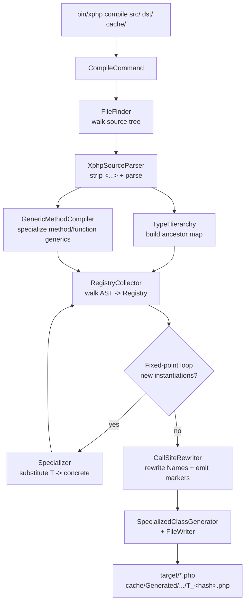
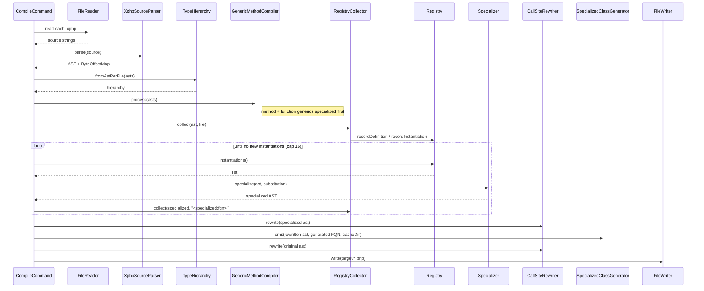
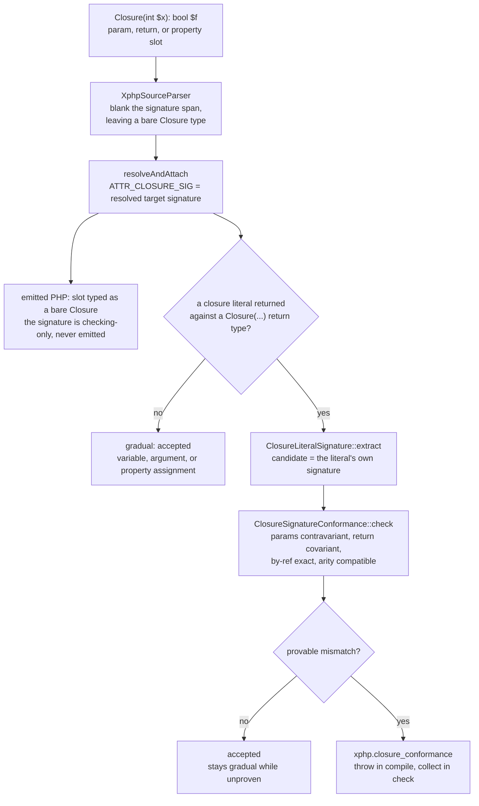
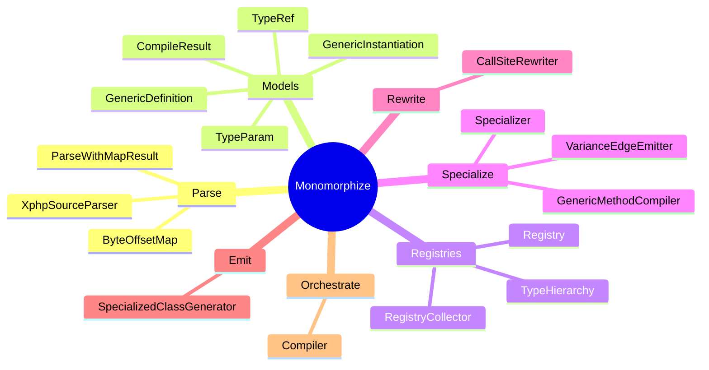

# How the xphp compiler works

Narrative walkthrough of the compile pipeline -- what `bin/xphp compile`
does between reading `.xphp` source and writing vanilla `.php` files
that any stock PHP 8.4 runtime can execute. Each stage has its own page
below, paired with a Mermaid diagram so the same information is
available both visually and in prose.

For the feature inventory ("what does xphp support today?") see the
[syntax tour](../syntax/index.md). For the strategic comparison against
TypeScript / Kotlin / Rust see [comparison](comparison.md). For the
forward-looking inventory see [roadmap](../roadmap.md).

---

## Pipeline overview

`bin/xphp compile <source-dir> [target-dir] [cache-dir]` runs a single
function -- [`Compiler::compile()`](../../src/Transpiler/Monomorphize/Compiler.php)
-- that orchestrates six stages. Only `<source-dir>` is required; `[target-dir]`
defaults to `dist` and `[cache-dir]` defaults to `.xphp-cache`. The data flows top-down: source bytes
turn into AST, the AST populates a Registry and a TypeHierarchy, a
fixed-point loop expands every concrete instantiation into a specialized
class file, and finally the rewritten user code lands in the target
directory while specialized classes land in a cache directory at
`<cache-dir>/Generated/<template>/T_<hash>.php` (autoloaded under the
`XPHP\Generated\` namespace).

> The code's internal phase labels are finer-grained than these
> stages -- `Phase 0` (parse), `1a`, `1b.i`, `1b.ii`, `2` (the
> fixed-point loop), `2.3`, `2.4`, `2.5` (variance-edge emission,
> Stage 4.5), `3`, `3.5`, `4`, and `5`. The stages group related
> phases for explanation; the source docblock comments are the
> authority on exact ordering. The validation gate is command-level
> orchestration around the pipeline (`xphp check`, and `compile`'s
> pre-emit safety pass), not a numbered phase.

The same lifecycle as a sequence diagram, showing call order between
participants:

---

## The stages

Each stage has its own page, in pipeline order:

1. [Stage 1 -- Source parsing](how-it-works/01-source-parsing.md) -- the strip-and-reattach trick that makes `Box<T>` parse as valid PHP.
2. [Stage 2 -- Hierarchy and Registry construction](how-it-works/02-hierarchy-and-registry.md) -- the ancestor map and the definition / instantiation bookkeeping.
3. [Stage 3 -- Method- and function-scope specialization](how-it-works/03-method-function-specialization.md) -- call-site-driven mangling for `method::<T>()` and `f<T>()`.
4. [Stage 4 -- Class-level fixed-point specialization](how-it-works/04-fixed-point-specialization.md) -- the loop that expands every instantiation, transitively.
5. [Stage 4.5 -- Variance-edge emission](how-it-works/04b-variance-edges.md) -- wiring real `extends` edges between specializations of a variant template.
6. [Stage 5 -- Rewriting and emission](how-it-works/05-rewriting-and-emission.md) -- Names become generated FQNs, templates become markers, files are written.
7. [Stage 6 -- Bound validation](how-it-works/06-bound-validation.md) -- the three-way subtype verdict, checked at instantiation time.
8. [The validation gate](how-it-works/07-validation-gate.md) -- how `xphp check` and a safe `xphp compile` share one gate.

---

## Cross-cutting concerns

### Marker interface trick

The compile-time replacement of generic class / interface templates
with empty marker interfaces is what makes
`$x instanceof App\Containers\Box` return `true` for any `Box<...>`
specialization at runtime. The bare `Box` name is a real interface
post-compile; every specialization implements it.

A side effect: bare `Box` (no `<...>`) is also a valid type hint
post-compile -- `function take(Box $b)` accepts any specialization.
That functionally covers the "any `Box`, no constraint on T" case
that Kotlin spells `Box<*>` and Java spells `Box<?>`.

Generic traits don't get a marker (PHP can't `instanceof` a trait),
so they're dropped entirely from the rewritten output.

### Hashing and collision detection

Generated FQNs follow the shape
`\XPHP\Generated\<template-FQCN>\T_<hash>`. The `<hash>` is a
SHA-256 digest of the canonical argument list, truncated to
`XPHP_HASH_LENGTH` hex characters (default 64, configurable in the
range 16-64 via the env var).

The canonical form joins arguments with `|`, recursively encoding
nested generics as `Name<Inner,...>`. Two distinct `(template,
args)` pairs that hash to the same FQCN trigger a build-time
collision error with both colliding instantiations, the current
hash length, and a copy-pasteable command to widen
`XPHP_HASH_LENGTH`. At the default 64 hex chars (256 bits),
birthday collisions are impossible at any practical project size.

### Position fidelity

Generic-clause blanking preserves positions on its own, so the only
length-changing rewrite is the `T[]` → `array` sugar. `ByteOffsetMap`
records those segments so any diagnostic span computed after the strip
can be translated back to the original `.xphp` source; with no such
rewrite it's the identity map.

### Closure signature types

A `Closure(int $x): bool` type hint documents the callable a slot
expects. PHP has no such syntax, so the signature is **erased to a bare
`\Closure`** in the emitted code -- it exists only to be checked, never
to be emitted. The check mirrors the variance PHP itself enforces when
an inherited method overrides its prototype.

The signature span is blanked exactly like a generic clause
(byte-length preserving), and `resolveAndAttach` hangs the resolved
target signature on the surviving `\Closure` node as
`ATTR_CLOSURE_SIG`. Only **one** site is statically decidable and thus
checked: a closure literal returned against a `Closure(...)` return
type (a typed-closure factory). A closure passed through a variable, a
call argument, or a property assignment is checked gradually
(accepted), because there is no static meeting point.

The check is deliberately one-directional -- it only rejects a
**provable** mismatch. An untyped parameter (⇒ `mixed`), an unresolved
class, a still-abstract type parameter, or a union / intersection
member leaves the relation unprovable and is accepted, mirroring the
RFC's runtime leniency.

A signature that names an **enclosing type parameter**
(`Closure(T $x)`) is checked twice: once at the template pre-loop with
`T` still abstract (gradually accepted), and again after the
fixed-point loop substitutes it (Phase 2.4) -- where `Registry<int>`
grounds the target to `Closure(int $x)` and a `string`-parameter
literal becomes a provable failure. See
[closure types](../syntax/closure-types.md) for the surface syntax.

---

## Class roster

The core classes under
[`src/Transpiler/Monomorphize/`](../../src/Transpiler/Monomorphize/),
grouped by role (validators and bound-AST nodes omitted for clarity).

**Parse** -- ingest `.xphp` source and produce an AST with generic
metadata reattached, plus a byte-offset map for position fidelity.

**Models** -- value objects representing one generic param
(`TypeParam`), one generic type reference (`TypeRef`), one template
declaration (`GenericDefinition`), one concrete instantiation
(`GenericInstantiation`), and the final compile output
(`CompileResult`).

**Registries** -- `Registry` records definitions + instantiations
and runs bound checks; `RegistryCollector` walks ASTs to populate it;
`TypeHierarchy` answers subtype questions for the bound check.

**Specialize** -- `Specializer` substitutes type-params in a cloned
template AST to produce a concrete specialization; `GenericMethodCompiler`
does the analogous job for method-scope and free-function generics; and
`VarianceEdgeEmitter` wires the subtype edges between specializations of
a variant template once they all exist.

**Rewrite** -- `CallSiteRewriter` swaps generic Name references for
the specialization's generated FQN and replaces generic ClassLike
templates with empty marker interfaces.

**Emit** -- `SpecializedClassGenerator` writes one specialized class
file per `(template, args)` pair into the cache directory.

**Orchestrate** -- `Compiler::compile()` wires the whole pipeline
together and drives the fixed-point loop.
