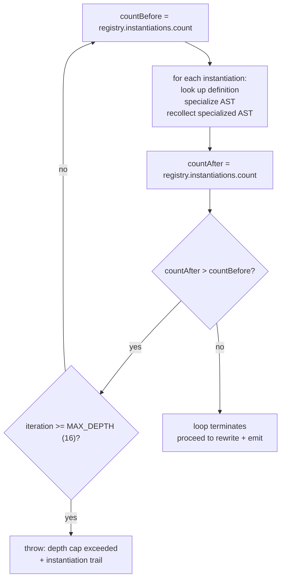

# Stage 4 -- Class-level fixed-point specialization

[← How the xphp compiler works](../how-it-works.md)

After method-scope specialization is done, the class-level loop runs
inside [`Compiler::compile()`](../../../src/Transpiler/Monomorphize/Compiler.php)
to drive the [`Specializer`](../../../src/Transpiler/Monomorphize/Specializer.php).

The loop is fixed-point because **specialization can introduce new
instantiations**. The textbook example: `class Wrapper<T> { public
Box<T> $b; }` is itself just a template, but when instantiated as
`Wrapper<Plastic>`, the substitution produces a body that references
`Box<Plastic>` -- a new instantiation that didn't exist in the
original source. The fixed-point loop catches that transitively
through any depth.

`Specializer::specialize()` takes the template AST and a substitution
map (`['T' => 'App\Models\Plastic']`), clones the AST, and replaces
every Name node referencing a type-param with a `FullyQualified`
node pointing at the concrete type. The result is a stand-alone
ClassLike AST that can be emitted as a normal `.php` file once
rewriting runs.

**The 16-iteration depth cap** exists to abort pathological recursive
types -- a `class Recursive<T> { public Box<Recursive<T>> $b; }` would
spin forever without it. On hitting the cap, the compiler throws with
the full instantiation trail so the user can see which template caused
the runaway.

---

Prev: [Stage 3 -- Method- and function-scope specialization](03-method-function-specialization.md) · [Index](../how-it-works.md) · Next: [Stage 4.5 -- Variance-edge emission](04b-variance-edges.md)
