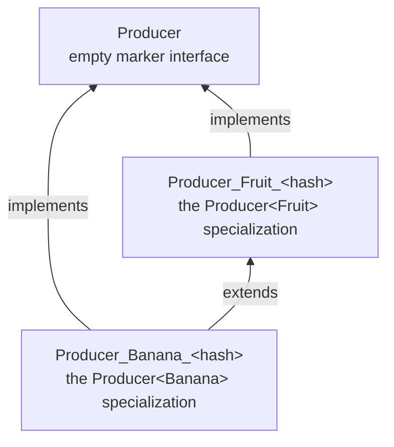

# Stage 4.5 -- Variance-edge emission

[← How the xphp compiler works](../how-it-works.md)

Once the fixed-point loop has recorded *every* specialization (and not
before -- the comparison is pairwise across the full set), a single
pass over the specialized ASTs wires up the real subtype edges that
declaration-site variance promises.
[`VarianceEdgeEmitter::emitEdges()`](../../../src/Transpiler/Monomorphize/VarianceEdgeEmitter.php)
walks each pair of specializations of the same variant template and,
where the type arguments are related the right way, adds the
`extends` / `implements` link between them: `Producer<Banana>`
actually `extends Producer<Fruit>` when `Banana extends Fruit` and
`T` is covariant (`out T`), dually for contravariant (`in T`). The edges
are appended to the cloned specialization's `implements` / `extends`
list and survive the next stage untouched -- the rewriter only
rewrites *template* `Class_` / `Interface_` nodes, not specialized
ones.

So the covariant promise holds at runtime: a `Producer<Banana>`
**is-a** `Producer<Fruit>` (assignable where the wider type is
expected), and both remain a bare `Producer` through the marker. A
contravariant `in T` reverses the edge -- `Consumer<Fruit> extends
Consumer<Banana>`.
[`VarianceSubtyping`](../../../src/Transpiler/Monomorphize/VarianceSubtyping.php)
decides each argument pair (invariant: equal; co-/contravariant: nested
subtype), and **only a provable edge is emitted** -- an unprovable pair
skips the edge rather than risk a wrong `extends` that would fatal at
autoload (a missed edge only loses an `instanceof` the compiler
couldn't prove). Class specializations take a single `extends`, and a
source-declared parent wins -- the same-template leaf edge is then
dropped (a missed `instanceof`, never a fatal); interface
specializations take a multi-target `extends`.

---

Prev: [Stage 4 -- Class-level fixed-point specialization](04-fixed-point-specialization.md) · [Index](../how-it-works.md) · Next: [Stage 5 -- Rewriting and emission](05-rewriting-and-emission.md)
