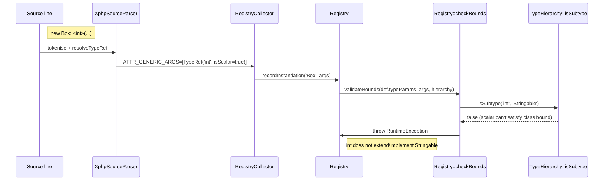

# Stage 6 -- Bound validation

[← How the xphp compiler works](../how-it-works.md)

Bound checks happen inside the Registry when an instantiation is
recorded. The validation is integrated into the recording flow so
violations fire at the source-level instantiation (e.g.
`new Box::<int>()`), not later when the obfuscated `T_<hash>` name
shows up.

`TypeHierarchy::isSubtype()` returns a **three-way verdict**:

- `true` -- the concrete type extends / implements / equals the
  bound (directly or transitively). Bound satisfied.
- `false` -- the concrete type is known to the hierarchy and does
  NOT have the bound in its ancestor closure. Also the answer for
  scalars vs class bounds. Bound violated.
- `null` -- the concrete type is not in the hierarchy and not a
  recognised built-in. The compiler can't prove satisfaction
  either way; the verdict surfaces as a distinct
  "not in the source set" error message so users can either widen
  the bound or include the missing type in the source set.

The same `Registry::checkBounds()` helper is reused by
`GenericMethodCompiler` for method-level type-param bounds, so
class-instantiation and method-call-site validations share the
exact same verdict-formatting + error-shape contract.

---

Prev: [Stage 5 -- Rewriting and emission](05-rewriting-and-emission.md) · [Index](../how-it-works.md) · Next: [The validation gate](07-validation-gate.md)
