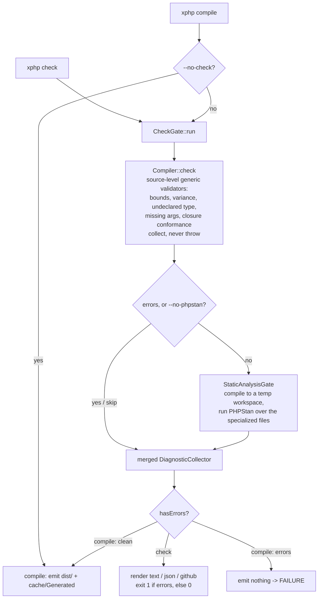

# The validation gate -- `check` and safe `compile`

[← How the xphp compiler works](../how-it-works.md)

`xphp check` validates without emitting anything, and `xphp compile`
runs that **same** gate before it writes a single file -- so a typo'd
type or an undeclared class fails the build at compile time instead of
slipping through to runtime. Both commands share one composed gate
([`CheckGate`](../../../src/StaticAnalysis/CheckGate.php)): the source-level
generic validators first, then -- only if those are clean -- PHPStan
over the compiled output.

[`Compiler::check()`](../../../src/Transpiler/Monomorphize/Compiler.php)
runs every source-level generic validator against a
`DiagnosticCollector` -- so it **collects** every error in one pass
instead of throwing on the first (the same validators throw in
`compile`). It is per-file resilient: a file that fails to parse
becomes one diagnostic and the rest are still checked. It stops after
collecting instantiations; it never specializes or emits.

The PHPStan pass runs **only** when the generic checks are clean and
`--no-phpstan` was not given.
[`StaticAnalysisGate`](../../../src/StaticAnalysis/StaticAnalysisGate.php)
compiles the sources into a throwaway temp workspace, picks one
representative specialized file per instantiation, and runs PHPStan
over them with the compiled output plus the consumer's `vendor/` on the
scan path. That real autoloader visibility is what makes the pass sound
-- a genuine plain-`.php` domain class used as a type argument resolves
and is never false-rejected. Findings map back to source diagnostics
and merge into the same collector.

`check` renders the merged diagnostics (`text` / `json` / `github`) and
exits non-zero if any are errors. `compile` emits nothing when the gate
reports an error (the gate runs before any file is written, so there is
nothing to roll back); otherwise it proceeds to the real
`Compiler::compile()`. `--no-check` skips the gate entirely for a
fast, trusted iteration build.

---

Prev: [Stage 6 -- Bound validation](06-bound-validation.md) · [Index](../how-it-works.md)
