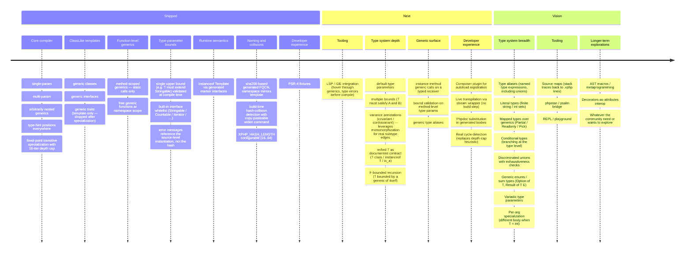

# Roadmap

The cross-language comparison that informs the "Next" and "Vision" sections below lives at
[`generics-comparison.md`](generics-comparison.md).

```mermaid
timeline
    section Shipped
        Core compiler
                : single-param
                : multi-param
                : arbitrarily nested generics
                : type-hint positions everywhere
                : fixed-point transitive specialization with 16-iter depth cap
        ClassLike templates
                : generic classes
                : generic interfaces
                : generic traits (template only — dropped after specialization)
        Function-level generics
                : method-scoped generics — static calls only
                : free generic functions at namespace scope
        Type-parameter bounds
                : single upper bound (e.g. T must extend Stringable) validated at compile time
                : built-in interface whitelist (Stringable / Countable / Iterator / …)
                : error messages reference the source-level instantiation, not the hash
        Runtime semantics
                : instanceof Template via generated marker interfaces
        Naming and collisions
                : sha256-based generated FQCN, namespace mirrors template
                : build-time hash-collision detection with copy-pasteable widen command
                : XPHP_HASH_LENGTH configurable (16..64)
        Developer experience
                : PSR-4 fixtures
    section Next
        Tooling
                : LSP / IDE integration (hover through generics, type errors before compile)
        Type system depth
                : default type parameters
                : multiple bounds (T must satisfy A and B)
                : variance annotations (covariant / contravariant) — leverages monomorphization for real subtype edges
                : reified T as documented contract (T-class / instanceof T / is_a)
                : F-bounded recursion (T bounded by a generic of itself)
        Generic surface
                : instance-method generic calls on a typed receiver
                : bound validation on method-level type-params
                : generic type aliases
        Developer experience
                : Composer plugin for autoload registration
                : Live transpilation via stream wrapper (no build step)
                : Phpdoc substitution in generated bodies
                : Real cycle detection (replaces depth-cap heuristic)
    section Vision
        Type system breadth
                : Type aliases (named type expressions, including unions)
                : Literal types (finite string / int sets)
                : Mapped types over generics (Partial / Readonly / Pick)
                : Conditional types (branching at the type level)
                : Discriminated unions with exhaustiveness checks
                : Generic enums / sum types (Option of T, Result of T E)
                : Variadic type parameters
                : Per-arg specialization (different body when T = int)
        Tooling
                : Source maps (stack traces back to .xphp lines)
                : phpstan / psalm bridge
                : REPL / playground
        Longer-term explorations
                : AST macros / metaprogramming
                : Decorators-as-attributes interop
                : Whatever the community need or wants to explore
```
