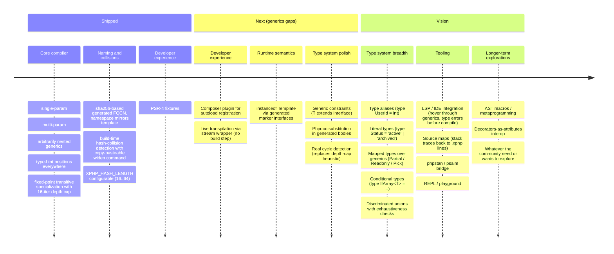

# Roadmap

```mermaid
timeline
    section Shipped
        Core compiler
                : single-param
                : multi-param
                : arbitrarily nested generics
                : type-hint positions everywhere
                : fixed-point transitive specialization with 16-iter depth cap
        Naming and collisions
                : sha256-based generated FQCN, namespace mirrors template
                : build-time hash-collision detection with copy-pasteable widen command
                : XPHP_HASH_LENGTH configurable (16..64)
        Developer experience
                : PSR-4 fixtures
    section Next (generics gaps)
        Developer experience
                : Composer plugin for autoload registration
                : Live transpilation via stream wrapper (no build step)
        Runtime semantics
                : instanceof Template via generated marker interfaces
        Type system polish
                : Generic constraints (T extends Interface)
                : Phpdoc substitution in generated bodies
                : Real cycle detection (replaces depth-cap heuristic)
    section Vision
        Type system breadth
                : Type aliases (type UserId = int)
                : Literal types (type Status = 'active' | 'archived')
                : Mapped types over generics (Partial / Readonly / Pick)
                : Conditional types (type IfArray<T> = ...)
                : Discriminated unions with exhaustiveness checks
        Tooling
                : LSP / IDE integration (hover through generics, type errors before compile)
                : Source maps (stack traces back to .xphp lines)
                : phpstan / psalm bridge
                : REPL / playground
        Longer-term explorations
                : AST macros / metaprogramming
                : Decorators-as-attributes interop
                : Whatever the community need or wants to explore
```
