# xphp roadmap

Syntax tracks [PHP RFC: bound-erased generic types](https://wiki.php.net/rfc/bound_erased_generic_types).
"Per RFC" anywhere below resolves there. Generics are the first
substantial chunk of work; many more capabilities are queued up
behind them.

See the [comparison with TypeScript / Kotlin / Rust](./guides/comparison.md)
for the strategic view, or the [syntax tour](./syntax/index.md) for a
hands-on look at every feature listed under Shipped.

## Overview

```mermaid
timeline
    section Shipped
        Core compiler
                : six-stage pipeline
                : arbitrarily nested generics
                : depth cap plus cycle detection
        Generic templates
                : classes and interfaces and traits
                : methods on static and instance receivers
                : methods inherited from base classes
                : free functions at any scope
                : closures and arrow functions
        Bounds
                : single upper bound
                : intersection multi-bound
                : DNF disjunctive normal form
                : F-bounded recursion
        Defaults
                : class level
                : method and function level
                : closure and arrow level
                : forward references
        Variance
                : covariant and contravariant markers
                : position rules
                : real subtype edges between specializations
                : inner template composition
        Pseudo-types
                : self static parent in type positions
                : constructor turbofish forms
        Closure signature types
                : typed callable hints in parameter return and property slots
                : erasure to a bare Closure
                : return-position conformance for closure literals
                : signatures grounded per specialization
        Reified T
                : runtime instanceof T
                : marker interface per template
        Type aliases
                : compile-time substitution, file-local
                : single-head union and nullable bodies
                : parameter defaults and bounds
        Developer experience
                : RFC-aligned call-site syntax
                : empty turbofish for all-defaults templates
                : optional turbofish via type-argument inference
        Validation and diagnostics
                : xphp check validate-only gate
                : collect-all diagnostics with text json github renderers
                : undeclared-type and arity validation
                : unresolved-generic-call detection
                : PHPStan over the compiled output
    section Discovery
        Generic surface
                : Variance edges on trait-owned templates
                : Branching narrowing precision
        Generic completeness
                : this-capturing and static generic closures
                : generic methods inherited via traits
                : trait composition for variance and bounds
                : closure signatures in generic args and bounds
        Module surface
                : internal visibility modifier
                : composer-package boundary
                : friend declarations
        Type system breadth
                : Wildcards via marker methods
                : Literal types
                : Mapped types
                : Conditional types
                : Discriminated unions
                : Generic enums and sum types
                : Variadic type parameters
                : Supertype lower bounds
                : Per-arg specialization
        Ecosystem
                : Live transpilation via stream wrapper
                : Source maps back to xphp lines
                : REPL and playground
                : Migration tooling from PHPDoc
        Explorations
                : AST macros and metaprogramming
                : Decorators interop
                : Community-driven explorations
```

The diagram above is a glance view; the sections below give each
shipped feature with its actual syntax and the rationale behind each
upcoming one.

---

## Shipped

### Core compiler

- Six-stage pipeline: parse → hierarchy → method-scope specialize →
  fixed-point class specialization → rewrite + emit → bound validate.
- Single-param, multi-param, arbitrarily nested generics.
- Type-hint positions everywhere (return, params, properties,
  `new`, `extends`, `implements`).
- Fixed-point transitive specialization with a 16-iteration depth cap.
- Real cycle detection as a backstop against pathological recursion.

### ClassLike templates

- Generic classes.
- Generic interfaces.
- Generic traits (template only — dropped after specialization
  because PHP can't `instanceof` a trait).

### Function-level generics

- Generic methods on static and instance receivers.
- Generic methods resolved through inheritance: a method declared on a
  base (or abstract) class is callable via turbofish on a subclass
  receiver (instance, static, nullsafe), emitted once on the declaring
  class and inherited.
- Generic free functions at namespace scope and bare top-level.
- Nullsafe instance turbofish (`$obj?->m::<T>()`).
- Receiver-type analysis for `$this`, typed parameters, typed
  properties, local `new` assignments, and a value returned by a
  method / chained call / `self`-`static` factory.
- Conservative branching: when a post-branch receiver can't be proved
  to a single type, a turbofish call is a compile error
  (`xphp.undetermined_receiver`) rather than a runtime-broken dispatch.
- Same-class merge: post-branch type kept when every reachable arm
  assigns the same class.
- Enclosing-parameter method bounds (`contains<U : E>`) grounded against
  the receiver, or a compile error (`xphp.bound_unprovable`) when the
  element type can't be determined.
- Erasure lowering of a direct-input `<U : E>` method (one `E`-typed member
  per instantiation), so a forwarded self-call
  (`probe<U : E>{ $this->contains::<U>(…) }`) compiles and runs; a forward to
  a non-erasable method is a compile error (`xphp.unspecializable_self_call`).
- Enclosing-parameter turbofish grounding: a turbofish whose type argument is
  supplied by the enclosing generic scope (`identity::<T>($v)` inside `wrap<T>`,
  `self::gen::<T>()` / `Maker::wrap::<T>()`, `$this->dup::<T>()`) grounds **per
  specialization** and runs, instead of being rejected by the emitted-marker
  backstop. Freshly specialized bodies are re-grounded transitively so
  multi-hop and mutually recursive forwards converge; a strictly-growing chain
  (`grow<T>` calling `grow::<Box<T>>`) is rejected as non-convergent
  (`xphp.unconverged_method_specialization`). `compile` and `check` report this
  identically.

### Anonymous templates

- Generic closures: `function<T>(...) {...}`.
- Generic arrow functions: `fn<T>(...) => ...`.
- Implicit captures on arrows lifted into the dispatch shape.
- Explicit `use (...)` clauses including by-ref `use (&$y)`.
- Empty-turbofish `$f::<>()` for all-defaults templates.

### Type-parameter bounds

- Single upper bound (e.g. `T : Stringable`) checked at compile time.
- Multi-bound intersection (e.g. `T : A & B`).
- DNF bound (e.g. `T : (A & B) | C`).
- F-bounded recursion (e.g. `T : Comparable<T>`).
- Built-in interface whitelist (Stringable / Countable / Iterator / ...).
- Error messages reference the source-level instantiation, not the
  generated hash.

### Default type parameters

- Class-level defaults.
- Method and free-function defaults.
- Anonymous closure and arrow defaults.
- Forward references (e.g. `Pair<A, B = A>`).
- Declaration-time bound check on fully-concrete defaults.

### Variance

- `out T` and `in T` markers on type parameters.
- Position rules enforced at compile time (covariant in return,
  contravariant in param, any variance in a plain non-promoted
  constructor parameter or a *private* property — declared or promoted;
  both forbidden in public/protected properties — including
  public/protected promoted constructor params — by-reference params,
  bounds, and defaults).
- Real-typed construction: a `out T`/`in T` constructor parameter keeps its
  concrete type (nothing erased), so construction is runtime-type-checked.
- A `final` variant class is rejected (a `final` class can't anchor the
  `extends` edge).
- Subtype edges emitted between specializations
  (`Producer<Banana>` actually extends `Producer<Fruit>` when
  `Banana extends Fruit`).
- Inner-template variance composition across nested generic args.

### Pseudo-types

- `self<T>` / `static<T>` / `parent<T>` in type-hint positions.
- `new self::<T>(...)`, `new parent::<T>(...)`,
  `new static::<T>(...)` at constructor sites.

### Closure signature types

- `Closure(int $x, string $y): bool` accepted in parameter, return, and
  property positions (including nested inside another signature);
  erases to a bare `\Closure` in the emitted PHP.
- Return-position conformance for closure literals: parameters
  contravariant, return covariant, by-reference exact, arity
  compatible — only a *provable* mismatch is rejected
  (`xphp.closure_conformance`).
- Signatures that reference an enclosing type parameter are grounded
  per specialization; `compile` and `check` apply the identical check.
- Flat union / intersection / nullable members are variance-checked
  member by member; DNF and array-sugar leaves stay gradual (accepted).
- Unsupported forms (a signature as a generic type argument or
  bound, an untyped or defaulted signature parameter) are clear
  compile errors, never miscompiles — see
  [closure types → known limitations](syntax/closure-types.md#known-limitations).

### Reified T

- `instanceof T`, `T::class`, `T $arg` runtime-checked via
  monomorphization.
- Marker interface per template so `$x instanceof App\Box` works
  across every `Box<...>` specialization.

### Type aliases

- `type Name<A, B> = Body;` and `type Name = Body;` — a compile-time
  substitution expanded into its body before specialization, with no
  runtime existence (the emitted PHP never mentions the alias).
- Single-head, **union** (`int|string`), and **nullable** (`?Box`) bodies.
  A single head expands in every type position (incl. as a generic
  argument, `Bag<UserId>`); a union/nullable expands as the whole type of a
  slot. Composes with nested and concrete-instantiation aliases.
- Parameters carry **defaults** (`type P<A, B = A>` — a use may omit
  trailing defaulted arguments) and **bounds** (`type B<T : Named>` — an
  argument that violates the bound is a compile error), like a generic class.
- **File-local by design**: an alias is visible only in the file that
  declares it (like a `use` alias); declare it per file to share it.
- Cyclic, arity-mismatched, class-colliding, duplicate, unsupported-body
  (intersection / DNF / closure), compound-in-non-slot, and
  bound-violating uses are loud compile errors in both `compile` and
  `check`, each with a stable code.
- See the [type aliases](syntax/type-aliases.md) tour and the
  [body / position limits caveat](caveats.md#type-alias-body-and-position-limits).

### Naming and collisions

- SHA-256-based generated FQCN; namespace mirrors the template.
- Build-time hash-collision detection with a copy-pasteable widen
  command in the error.
- `XPHP_HASH_LENGTH` configurable (16..64).

### Developer experience

- RFC-aligned call-site syntax (`Name::<...>` turbofish).
- Empty turbofish (`Name::<>`) for all-defaults templates.
- **Type-argument inference (optional turbofish)**: a generic call or `new`
  whose type parameters are fixed by the argument values drops the turbofish
  — `identity(5)` infers `identity::<int>`, `new Box($product)` infers
  `new Box::<Product>` — compiling to the exact specialization the turbofish
  would have selected. Free functions, static/instance methods, and `new`.
  Where the arguments don't determine the type (a parameter only in the return
  type, an unknown or conflicting argument type), the explicit turbofish is
  still required. See the
  [turbofish → inference](syntax/turbofish.md#type-argument-inference) tour and
  [caveats](caveats.md#type-argument-inference-is-partial).

### Validation and diagnostics

- `xphp check` — a validate-only gate that emits no code: it runs
  every generic validation and reports **all** problems in one pass
  (collect-all), each with a `file:line` location and a stable code,
  exiting 0 (clean) / 1 (errors) / 2 (bad input).
- Structured diagnostics with `text`, `json`, and `github`
  (Actions-annotation) renderers, so the same check drives both local
  use and CI.
- Undeclared-type-parameter and over-arity validation (a member,
  bound, or default that names a stray/typo'd type; more type
  arguments than the template declares).
- Unresolved-generic-call detection: a turbofish method call whose
  generic method exists on neither the receiver nor any ancestor is a
  compile-time error instead of a silent runtime fatal.
- PHPStan over the compiled output: `check` compiles to a throwaway
  directory, runs *your* PHPStan over the monomorphized code (one
  representative per template), and maps findings back to the `.xphp`
  template. Opt-out via `--no-phpstan`; an absent binary degrades to a
  non-failing Warning; never bundled in the PHAR.

---

## Discovery

Items in this section are open design questions, not committed work.
Each has a sketched answer to "would xphp support this?" but the
implementation knobs are still being settled. Treat each Discovery
entry as a starting point for community discussion, not a guarantee
to ship.

### Generic surface

- Variance edges on trait-owned templates.
- Branching narrowing precision: today a turbofish call on a receiver
  whose branch arms disagree is a compile error; could track unions with
  runtime dispatch instead.
- Per-instantiation checking of a **direct concrete** `$this`-self-call's
  enclosing-parameter bound (`$this->contains::<Banana>()`, today a compile
  error), to accept the calls that hold for the instantiations actually used.
  (The common *forwarding* shape already works via erasure lowering — see
  Shipped.)

### Generic completeness

Gaps in already-shipped generics, deferred rather than designed out:

- `$this`-capturing and `static` generic closures: both are rejected
  today; lifting them (rewrite `$this->x` to a passed parameter; route
  `static` closures through the dispatcher) is planned.
- Generic methods inherited through traits: resolution follows
  `extends` / `implements` ancestors, but a generic method reached only
  via a `use`d trait is not yet resolved.
- Trait composition for variance and bounds: the variance-position
  validator doesn't walk trait-imported method signatures, and bound
  satisfaction doesn't follow trait chains — both currently unmodeled.
- Closure signature types as generic type arguments and bounds
  (`Box<Closure(int): int>`, `class C<T : Closure(int): int>`): both
  rejected today with a closure-specific error; lifting them is a
  candidate. A bare `\Closure` works in every such position now.
- Structuring a DNF leaf inside a `Closure(...)` signature
  (`Closure((A&B)|C $x)`) into variance-checked members — today it
  stays gradual (accepted, never the cause of a rejection).

### Module surface

- **`internal` visibility modifier**: replace PHPDoc `@internal` hints
  with a first-class keyword that the compiler enforces at the
  Composer-package boundary. Cross-package references to internal
  symbols become compile errors. The open question is whether to
  derive the boundary from `composer.json` alone or via an explicit
  `xphp.json` for sub-package granularity.
- Friend declarations: per-symbol overrides to the package boundary
  (the Rust `pub(super)` / Kotlin `@PublishedApi` shape).

### Type system breadth

- **Wildcards via marker methods**: populate the empty marker
  interface with upper-bound-typed read-only methods so
  `function f(Box $b)` becomes a real `Box<*>` you can read
  through, matching Kotlin and TS wildcard ergonomics. The
  existential position already exists (the bare template-name
  form); only the method surface is missing. See
  [runtime semantics → marker interfaces as wildcard-shaped positions](./guides/runtime-semantics.md#marker-interfaces-as-wildcard-shaped-positions).
- Literal types (finite string / int sets).
- Mapped types over generics (`Partial`, `Readonly`, `Pick`).
- Conditional types (branching at the type level).
- Discriminated unions with exhaustiveness checks.
- Generic enums / sum types (Option of T, Result of T E).
- Variadic type parameters.
- **Supertype (lower) bounds** on a type parameter (`<S : super E>`, Scala's
  `[S >: T]`): let a *widening* operation — a `reduce` / `fold`-to-supertype on a
  covariant collection — be a fluent member (`$list->reduceOrNull::<Product>(…)`)
  instead of the static sibling-bound helper (`<S, T : S>`) that expresses the same
  capability today. The gap is member ergonomics only; bounds are otherwise
  upper-only by design — see
  [ADR-0022](./adr/0022-bounds-are-upper-only.md) and
  [type bounds → no supertype bounds](./syntax/type-bounds.md#no-supertype-lower-bounds).
- Per-arg specialization (different body when T = int).

### Ecosystem

- Live transpilation via stream wrapper (no build step in dev).
- Source maps (stack traces back to `.xphp` lines).
- Psalm bridge (the PHPStan bridge has shipped — see Shipped above).
- REPL / playground.
- Migration tooling: lift PHPDoc `@template` annotations to xphp
  generic params.

### Explorations

- AST macros / metaprogramming.
- Decorators-as-attributes interop.
- Whatever the community wants to explore.
