# xphp roadmap

Syntax tracks [PHP RFC: bound-erased generic types](https://wiki.php.net/rfc/bound_erased_generic_types).
"Per RFC" anywhere below resolves there. Generics are the first
substantial chunk of work; many more capabilities are queued up
behind them.

See the [comparison with TypeScript / Kotlin / Rust](./guides/comparison.md)
for the strategic view, or the [syntax tour](./syntax/index.md) for a
hands-on look at every feature listed under Shipped.

## Overview

```mermaid
timeline
    section Shipped
        Core compiler
                : six-stage pipeline
                : arbitrarily nested generics
                : depth cap plus cycle detection
        Generic templates
                : classes and interfaces and traits
                : methods on static and instance receivers
                : methods inherited from base classes
                : free functions at any scope
                : closures and arrow functions
        Bounds
                : single upper bound
                : intersection multi-bound
                : DNF disjunctive normal form
                : F-bounded recursion
        Defaults
                : class level
                : method and function level
                : closure and arrow level
                : forward references
        Variance
                : covariant and contravariant markers
                : position rules
                : real subtype edges between specializations
                : inner template composition
        Pseudo-types
                : self static parent in type positions
                : constructor turbofish forms
        Reified T
                : runtime instanceof T
                : marker interface per template
        Developer experience
                : RFC-aligned call-site syntax
                : empty turbofish for all-defaults templates
        Validation and diagnostics
                : xphp check validate-only gate
                : collect-all diagnostics with text json github renderers
                : undeclared-type and arity validation
                : unresolved-generic-call detection
                : PHPStan over the compiled output
    section Next
        Editor and tooling
                : Live transpilation via stream wrapper
        Compiler ergonomics
                : Source maps back to xphp lines
    section Discovery
        Generic surface
                : Generic type aliases
                : Variance edges on trait-owned templates
                : Branching narrowing precision
        Generic completeness
                : this-capturing and static generic closures
                : generic methods inherited via traits
                : trait composition for variance and bounds
        Module surface
                : internal visibility modifier
                : composer-package boundary
                : friend declarations
        Type system breadth
                : Wildcards via marker methods
                : Literal types
                : Mapped types
                : Conditional types
                : Discriminated unions
                : Generic enums and sum types
                : Variadic type parameters
                : Per-arg specialization
        Ecosystem
                : REPL and playground
                : Migration tooling from PHPDoc
        Explorations
                : AST macros and metaprogramming
                : Decorators interop
                : Community-driven explorations
```

The diagram above is a glance view; the sections below give each
shipped feature with its actual syntax and the rationale behind each
upcoming one.

---

## Shipped

### Core compiler

- Six-stage pipeline: parse → hierarchy → method-scope specialize →
  fixed-point class specialization → rewrite + emit → bound validate.
- Single-param, multi-param, arbitrarily nested generics.
- Type-hint positions everywhere (return, params, properties,
  `new`, `extends`, `implements`).
- Fixed-point transitive specialization with a 16-iteration depth cap.
- Real cycle detection as a backstop against pathological recursion.

### ClassLike templates

- Generic classes.
- Generic interfaces.
- Generic traits (template only — dropped after specialization
  because PHP can't `instanceof` a trait).

### Function-level generics

- Generic methods on static and instance receivers.
- Generic methods resolved through inheritance: a method declared on a
  base (or abstract) class is callable via turbofish on a subclass
  receiver (instance, static, nullsafe), emitted once on the declaring
  class and inherited.
- Generic free functions at namespace scope and bare top-level.
- Nullsafe instance turbofish (`$obj?->m::<T>()`).
- Receiver-type analysis for `$this`, typed parameters, typed
  properties, and local `$x = new Foo()` assignments.
- Conservative branching: post-branch calls de-specialize on
  reassignment rather than risking a wrong dispatch.
- Same-class merge: post-branch type kept when every reachable arm
  assigns the same class.

### Anonymous templates

- Generic closures: `function<T>(...) {...}`.
- Generic arrow functions: `fn<T>(...) => ...`.
- Implicit captures on arrows lifted into the dispatch shape.
- Explicit `use (...)` clauses including by-ref `use (&$y)`.
- Empty-turbofish `$f::<>()` for all-defaults templates.

### Type-parameter bounds

- Single upper bound (e.g. `T : Stringable`) checked at compile time.
- Multi-bound intersection (e.g. `T : A & B`).
- DNF bound (e.g. `T : (A & B) | C`).
- F-bounded recursion (e.g. `T : Comparable<T>`).
- Built-in interface whitelist (Stringable / Countable / Iterator / ...).
- Error messages reference the source-level instantiation, not the
  generated hash.

### Default type parameters

- Class-level defaults.
- Method and free-function defaults.
- Anonymous closure and arrow defaults.
- Forward references (e.g. `Pair<A, B = A>`).
- Declaration-time bound check on fully-concrete defaults.

### Variance

- `+T` and `-T` markers on type parameters.
- Position rules enforced at compile time (covariant in return,
  contravariant in param, any variance in a plain non-promoted
  constructor parameter; both forbidden in properties — including
  promoted constructor params — by-reference params, bounds, and
  defaults).
- Real-typed construction: a `+T`/`-T` constructor parameter keeps its
  concrete type (nothing erased), so construction is runtime-type-checked.
- A `final` variant class is rejected (a `final` class can't anchor the
  `extends` edge).
- Subtype edges emitted between specializations
  (`Producer<Banana>` actually extends `Producer<Fruit>` when
  `Banana extends Fruit`).
- Inner-template variance composition across nested generic args.

### Pseudo-types

- `self<T>` / `static<T>` / `parent<T>` in type-hint positions.
- `new self::<T>(...)`, `new parent::<T>(...)`,
  `new static::<T>(...)` at constructor sites.

### Reified T

- `instanceof T`, `T::class`, `T $arg` runtime-checked via
  monomorphization.
- Marker interface per template so `$x instanceof App\Box` works
  across every `Box<...>` specialization.

### Naming and collisions

- SHA-256-based generated FQCN; namespace mirrors the template.
- Build-time hash-collision detection with a copy-pasteable widen
  command in the error.
- `XPHP_HASH_LENGTH` configurable (16..64).

### Developer experience

- RFC-aligned call-site syntax (`Name::<...>` turbofish).
- Empty turbofish (`Name::<>`) for all-defaults templates.

### Validation and diagnostics

- `xphp check` — a validate-only gate that emits no code: it runs
  every generic validation and reports **all** problems in one pass
  (collect-all), each with a `file:line` location and a stable code,
  exiting 0 (clean) / 1 (errors) / 2 (bad input).
- Structured diagnostics with `text`, `json`, and `github`
  (Actions-annotation) renderers, so the same check drives both local
  use and CI.
- Undeclared-type-parameter and over-arity validation (a member,
  bound, or default that names a stray/typo'd type; more type
  arguments than the template declares).
- Unresolved-generic-call detection: a turbofish method call whose
  generic method exists on neither the receiver nor any ancestor is a
  compile-time error instead of a silent runtime fatal.
- PHPStan over the compiled output: `check` compiles to a throwaway
  directory, runs *your* PHPStan over the monomorphized code (one
  representative per template), and maps findings back to the `.xphp`
  template. Opt-out via `--no-phpstan`; an absent binary degrades to a
  non-failing Warning; never bundled in the PHAR.

---

## Next

### Editor and tooling

- Live transpilation via stream wrapper (no build step in dev).

### Compiler ergonomics

- Source maps (stack traces back to `.xphp` lines).

---

## Discovery

Items in this section are open design questions, not committed work.
Each has a sketched answer to "would xphp support this?" but the
implementation knobs are still being settled. Treat each Discovery
entry as a starting point for community discussion, not a guarantee
to ship.

### Generic surface

- Generic type aliases (e.g. `type Pair<A, B> = ...`).
- Variance edges on trait-owned templates.
- Branching narrowing precision: today conservatively de-specializes
  when arms disagree; will track unions with runtime dispatch instead.

### Generic completeness

Gaps in already-shipped generics, deferred rather than designed out:

- `$this`-capturing and `static` generic closures: both are rejected
  today; lifting them (rewrite `$this->x` to a passed parameter; route
  `static` closures through the dispatcher) is planned.
- Generic methods inherited through traits: resolution follows
  `extends` / `implements` ancestors, but a generic method reached only
  via a `use`d trait is not yet resolved.
- Trait composition for variance and bounds: the variance-position
  validator doesn't walk trait-imported method signatures, and bound
  satisfaction doesn't follow trait chains — both currently unmodeled.

### Module surface

- **`internal` visibility modifier**: replace PHPDoc `@internal` hints
  with a first-class keyword that the compiler enforces at the
  Composer-package boundary. Cross-package references to internal
  symbols become compile errors. The open question is whether to
  derive the boundary from `composer.json` alone or via an explicit
  `xphp.json` for sub-package granularity.
- Friend declarations: per-symbol overrides to the package boundary
  (the Rust `pub(super)` / Kotlin `@PublishedApi` shape).

### Type system breadth

- **Wildcards via marker methods**: populate the empty marker
  interface with upper-bound-typed read-only methods so
  `function f(Box $b)` becomes a real `Box<*>` you can read
  through, matching Kotlin and TS wildcard ergonomics. The
  existential position already exists (the bare template-name
  form); only the method surface is missing. See
  [runtime semantics → marker interfaces as wildcard-shaped positions](./guides/runtime-semantics.md#marker-interfaces-as-wildcard-shaped-positions).
- Literal types (finite string / int sets).
- Mapped types over generics (`Partial`, `Readonly`, `Pick`).
- Conditional types (branching at the type level).
- Discriminated unions with exhaustiveness checks.
- Generic enums / sum types (Option of T, Result of T E).
- Variadic type parameters.
- Per-arg specialization (different body when T = int).

### Ecosystem

- Psalm bridge (the PHPStan bridge has shipped — see Shipped above).
- REPL / playground.
- Migration tooling: lift PHPDoc `@template` annotations to xphp
  generic params.

### Explorations

- AST macros / metaprogramming.
- Decorators-as-attributes interop.
- Whatever the community wants to explore.
