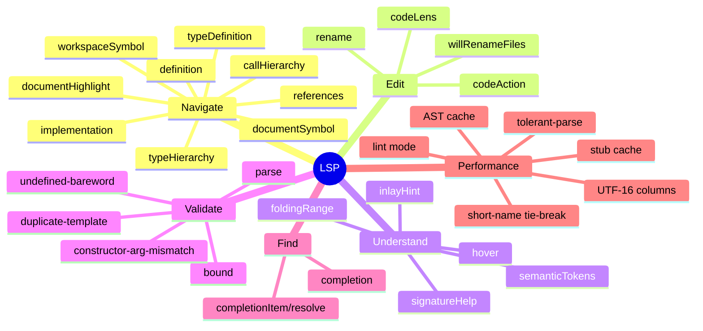

# xphp Language Server

Language Server Protocol \[partial\] implementation that powers editor
intelligence for `xphp` files across any LSP-capable editor:

- diagnostics
- navigation
- refactoring
- completion
- code lenses

The server can be shipped as a self-contained PHAR that can be used by other
tools, like IDE plugins.

The server reuses the parent `xphp` package's AST, generic-instantiation
`Registry`, and `TypeHierarchy` directly -- no second parser, no duplicated
language semantics.

For the public-facing feature inventory plus what's planned next, see
[`docs/roadmap.md`](docs/roadmap.md).

---

## Install

```bash
composer require xphp-lang/lsp
```

---

## Build

```bash
make build/phar # → var/xphp-lsp.phar
```

The PHAR is the distribution format for editor integrations bundle --
zero-config install for editors that can't reasonably depend on a
Composer-managed working tree. 

---

## Overview



See [detailed list of features](docs/features/index.md) for more info about use cases and LSP
methods that are implemented.
