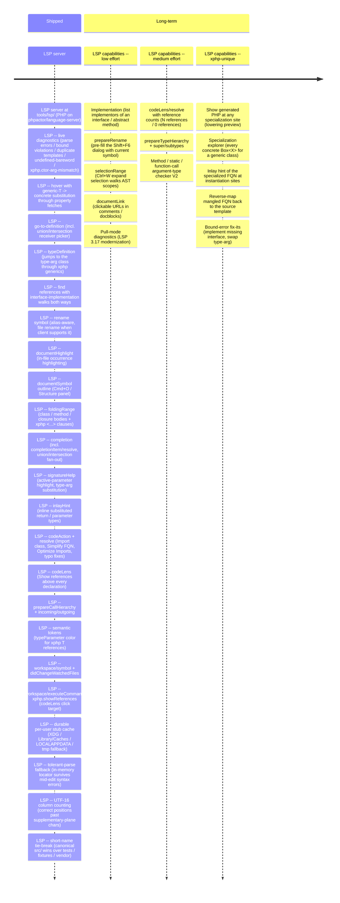

# tools/lsp roadmap

LSP server (PHP, on `phpactor/language-server`). Drives both editor
clients via the same protocol surface.

For the compiler / language roadmap see [`../../core/roadmap.md`](../../core/roadmap.md).

